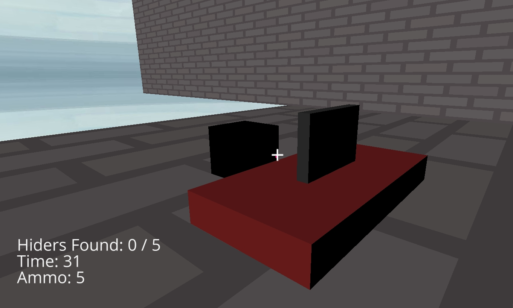
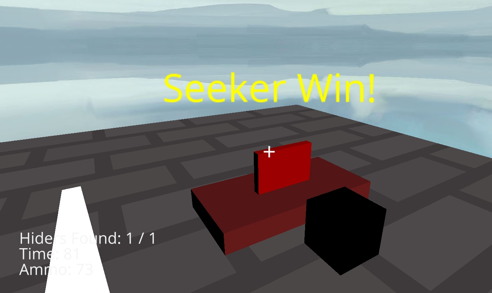
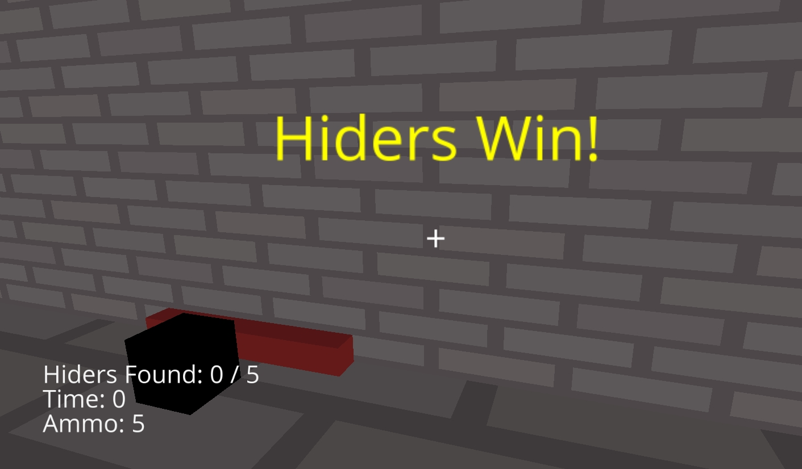

# AI Hide & Seek Simulator (AI躲猫猫模拟器)

<p style="text-align:center;">一个基于AI的3D躲猫猫游戏框架，探索人工智能在空间策略与伪装中的行为模式。</p>


<p style="text-align:center;">
AI Hide & Seek v1
</p>

---


### 🤔 这是什么？ (What is this?)

欢迎来到AI躲猫猫模拟器！

这不仅仅是一个简单的游戏，更是我们构建一个复杂AI行为模拟器的第一步。在这个项目中，我们的长远目标是探索“搜寻”与“躲藏”着两种核心策略。我们将开发能在复杂3D环境中像道具一样伪装自己的**AI躲藏者**，以及能通过高效策略找出它们**AI搜捕者**。

当然，人类玩家也可以随时加入，扮演搜捕者或躲藏者，与AI进行对抗或合作。


**当前版本 (v0.2)** 是一个功能性的游戏框架，允许人类玩家扮演**搜捕者**，在预设的3D办公室场景中，找出由程序随机指定的、伪装成普通道具的**躲藏者**。

> **Our Vision:** Using AI to play hide and seek, where the game includes AI that acts as props in the scene, and others that find them, whether AI or humans.

---

### 🎮 游戏规则与玩法 (Rules & Gameplay)

**阵营与目标:**
* **搜捕者 (Seeker / 你):** 你的目标是在有限的时间和子弹内，找出所有伪装成普通道具的“躲藏者”。
* **躲藏者 (Hiders / 电脑):** 它们是场景中的一部分，被随机指定为“躲藏者”。它们的目标就是在游戏结束前不被发现。

**胜利条件:**
* 🏆 **搜捕者胜利:** 找到所有的躲藏者。

* 🏆 **躲藏者胜利:** 时间耗尽或搜捕者子弹用完时，仍有至少一个躲藏者存活。

**操作方法:**
* **移动 (Move):** `W` `A` `S` `D`
* **环顾 (Look):** `移动鼠标 (Mouse)`
* **射击/检查 (Shoot/Check):** `鼠标左键 (Left Mouse Button)`
* **跳跃 (Jump):** `空格键 (Spacebar)`
* **游戏截图 (Screenshot):** `F2` (下方有功能说明)
* **退出游戏 (Quit):** `Q` (仅在游戏结束后)

---

### 🚀 如何运行 (How to Run)

本项目使用 Python 和 Ursina 引擎开发。

1.  **确保你已安装 Python。**
2.  **安装 Ursina 引擎:**
    ```bash
    pip install ursina
    ```
3.  **运行游戏:**
    ```bash
    python src/hide_and_seek_3d.py
    ```

---
*祝你玩得开心！*

<!-- 
<style>
img.center {
  display: block;
  margin-left: auto;
  margin-right: auto;

}
</style>
 -->
